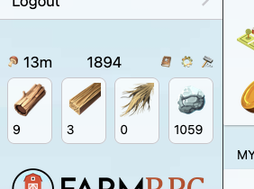
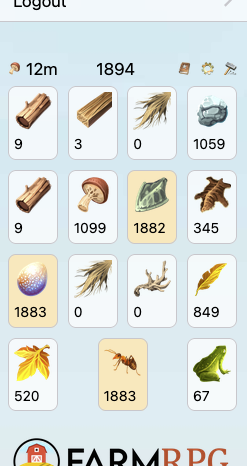
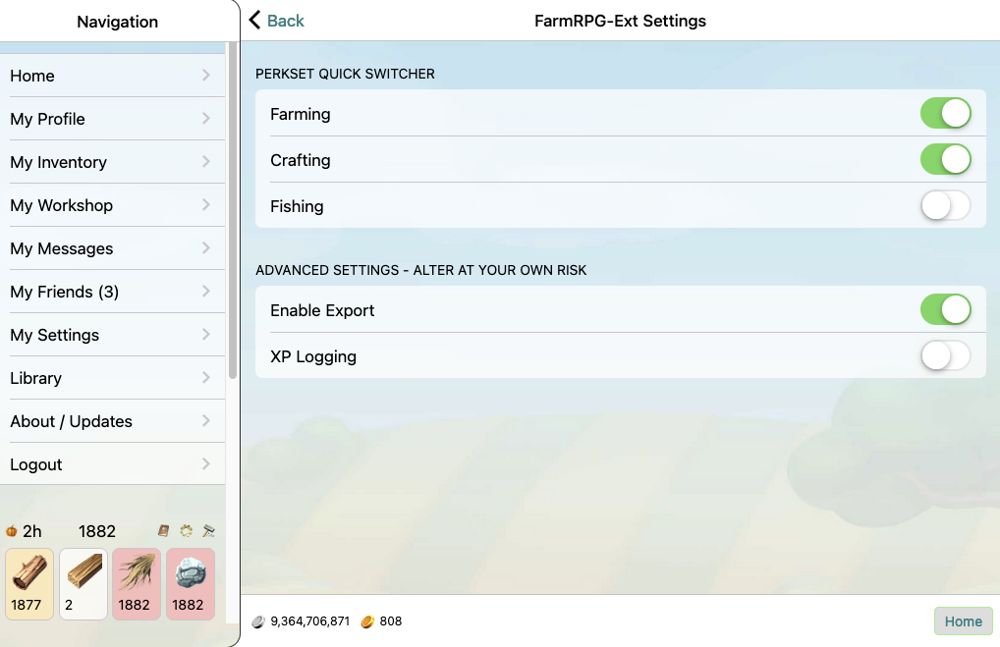

# FarmRPG-Ext

A Firefox extension for [FarmRPG](https://farmrpg.com/) to add advanced features, and Python libraries for analyzing game data.

## A Disclaimer

Bugs with this extension should NOT be submitted to FarmRPG staff. This extension is not part of the game, is not endorsed by the game, and is strictly my responsibility. Do not bother Firestream about anything here, seriously. While I know of no such bugs and test things extensively, this extension carries no warranty and if it disrupts your game in any way, game staff will not be able to help you. In most cases, uninstalling it will fix any such problems, but if you have used items or anything else similar, do not expect staff members to fix it.

## Installation

The browser extension is currently in limited beta. Please contact coderanger in-game or on Discord if you would like access.

## Will this work with Chrome/Safari/iOS/Android?

No, the browser extension requires Firefox specifically. Chrome support may be possible in the future but the others are likely impossible and out of scope at this time.

## Features

### Dynamic Sidebar

The main interface for the extension is an additional sidebar section added to the left bar in the game.

By default this sidebar has two sections, a status bar and a set of item icons. The status bar shows information on your currently growing crop, your maximum inventory size, and the buttons for accessing extension settings and the perkset quick switcher.

The icons section defaults to showing the 4 main passively-produced items: Wood, Boards, Straw, and Stone. This allows you to monitor the quantity of these resources while doing other things in the game. When you open a supported part of the game, the sidebar will update to show relevant information. For example, if you are exploring the Forest, you can see your inventory state for all items which drop there:

If you have ideas for places in the game which currently don't show a contextual sidebar and should, please message me your suggestions.

### Perkset Quick Switcher

If you are a beta (or above) user and have access to the perksets feature in the game, you will find a quick switcher button at the top of the extension's sidebar. To enable this you first need to open the perks page so the extension can learn your perksets, then click the "gear" icon in the sidebar to open the extension settings. You should see something similar to this:

but with your perkset names instead. Click the buttons to enable whichever perksets you would like in the click rotation. Each time you click the switcher button, it will switch to the next enabled perkset in the list. To have the icons show up usefully, you need to name your perksets after either a skill or item in the game.

To restate from above: this will not give you access to perksets if you don't already have it. This is the same perkset system as beta (and above) uses but in a different place.

### Data Logging

The extension automatically records all drops and other game data you encounter. This is invisible and happens in the background. In the future there may be a way to submit this data to a central database to help research things like the drop rates of super rares, but not yet.

## Limitations

### Inventory Out Of Sync

To ensure both compliance with the Code of Conduct and create minimal extra load on the game servers, the extension is tracking all data locally including your inventory. What this means to you is it can sometimes be wrong. If you gain or lose items via any mechanism the extension doesn't know about, then the item count will be wrong. This is a problem with the local tracking, the game still has the correct values. If you visit your inventory, the extension will see the new values and update itself accordingly.

There are currently a few places this comes up often, such as when using apples while exploring, my hope is to fix them over time. However the core approach will never be 100% accurate at all times.

## Code of Conduct

The FarmRPG Code of Conduct specifically disallows botting, scripting, and any form of game automation. This extension is written to comply with both the specifics of this rule and a general philosophy of avoiding excess server load. Do not ask me to add an autoclicker or other game automation. That said, if the game staff asks everyone to stop, please uninstall this.
